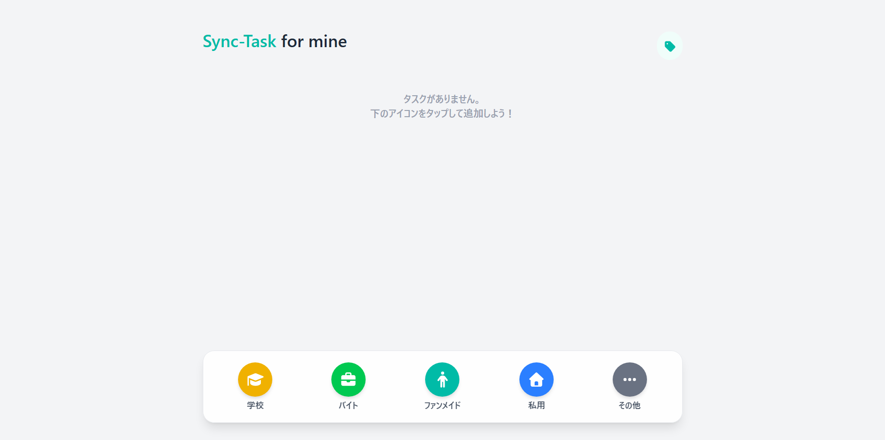
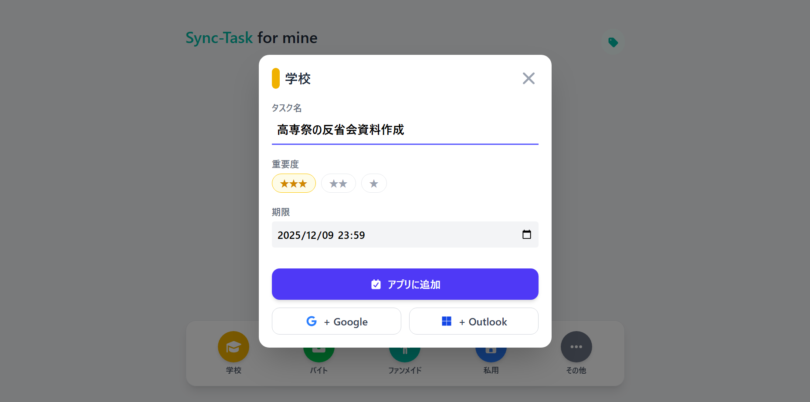
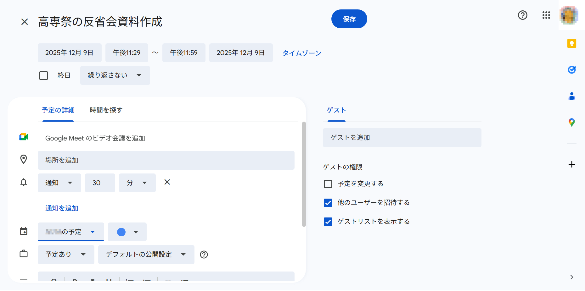
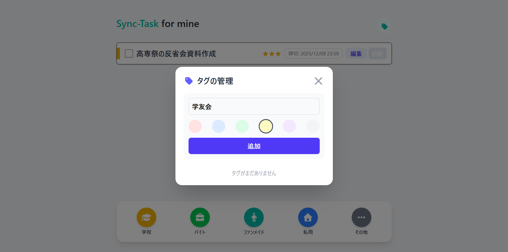

# Sync-Task for mine
**リンク:https://nmst0811.github.io/Sync-Task-for-mine/**

「Sync-Task for mine」はReact、TypeScript、Tailwind CSS を使用し、ローカルストレージでデータを永続化した「自分のためのTodoアプリ」です。

-----

## 主な機能とUI/UX

### 独自性：期限前30分間を確保するカレンダー連携機能

タスクの「期限」を設定すると、その期限の30分前から期限時刻までの間を自動的に作業時間として計算し、ワンクリックでカレンダーに登録できます。

**着想と経緯**: 単なる提出締切の通知ではなく、「提出に向けて集中して取り組む時間」を能動的に作るという、行動習慣のデザインを目的にしています。

**技術的な工夫**: タスク作成画面から、日付操作ライブラリ（dayjs）を用いて、正確に開始時刻`（期限-30分）`を逆算し、GoogleカレンダーおよびOutlookカレンダーのURLフォーマットに合わせた時刻文字列を生成しています。

---

### 柔軟なタスク分類を実現するカスタムタグ機能

タスク分類の柔軟性を高めるために、「固定カテゴリ」と「可変タグ」の二重構造を採用しました。

**着想と経緯**: カテゴリ（自分が使用するため）は固定ですが、タスクの性質（重要度、種類）は流動的であるため、この二重分類が必要だと考えました。

**技術的な工夫**: タグ管理画面（）を設け、タグ名と色を自由に設定・管理できるようにしました。タスク（Todo）にはタグIDの配列を持たせることで、データの正規化と柔軟なフィルタリングを可能にしています。

---

### UI/UXの工夫

カテゴリの最適化: アプリのカテゴリを私個人の学習・作業環境（**mine**na）に合わせて設定することで、汎用性を捨てて使用感の最適化を追求しました。

レスポンシブデザイン: モバイルでの利用を最優先に考え、素早いタスク作成・編集が外出先でも行えるよう、全てのコンポーネントをレスポンシブに対応させました。

| 項目 | 詳細 |
| ---- | ---- |
| 主要技術 | React (Hooks, Functional Components), TypeScript |
| スタイリング | Tailwind CSS (レスポンシブ対応) |
| ライブラリ | dayjs (日付操作), uuid (ID生成) |
| データ永続化 | LocalStorage (ブラウザストレージ)|

---

## 開発履歴

- 2025年10月23日：プロジェクト開始 

---

## ライセンス

MIT License

Copyright (c) 2025 minena / Umamimi

Permission is hereby granted, free of charge, to any person obtaining a copy
of this software and associated documentation files (the "Software"), to deal
in the Software without restriction, including without limitation the rights
to use, copy, modify, merge, publish, distribute, sublicense, and/or sell
copies of the Software, and to permit persons to whom the Software is
furnished to do so, subject to the following conditions:

The above copyright notice and this permission notice shall be included in all
copies or substantial portions of the Software.

THE SOFTWARE IS PROVIDED "AS IS", WITHOUT WARRANTY OF ANY KIND, EXPRESS OR
IMPLIED, INCLUDING BUT NOT LIMITED TO THE WARRANTIES OF MERCHANTABILITY,
FITNESS FOR A PARTICULAR PURPOSE AND NONINFRINGEMENT. IN NO EVENT SHALL THE
AUTHORS OR COPYRIGHT HOLDERS BE LIABLE FOR ANY CLAIM, DAMAGES OR OTHER
LIABILITY, WHETHER IN AN ACTION OF CONTRACT, TORT OR OTHERWISE, ARISING FROM,
OUT OF OR IN CONNECTION WITH THE SOFTWARE OR THE USE OR OTHER DEALINGS IN THE
SOFTWARE.

---

**開発期間: 2025.10.23 ~ 2025.11.19 (約25時間)**